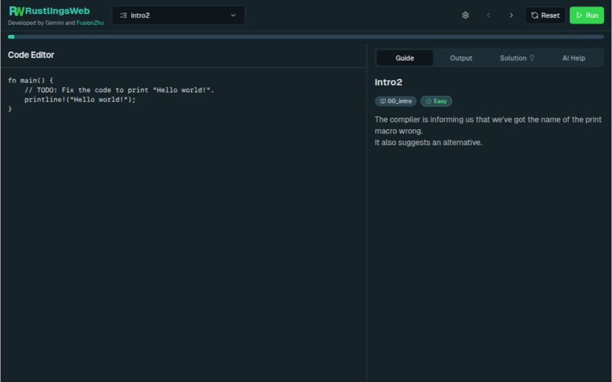

# Rustlings Web

Welcome to Rustlings Web! This project brings the popular terminal-based Rust learning tool, `rustlings`, to your web browser, offering a convenient and user-friendly way to practice Rust exercises. Say goodbye to the command line and hello to a smooth web interface for your Rust journey.

## Features

Rustlings Web is packed with features to enhance your learning experience:

- **AI Help**: Get assistance and explanations for exercises directly within the web interface.
- **Easy Navigation**: Navigate effortlessly between different Rustling exercises with our intuitive interface.
- **Structured Layout**: A clean and organized layout with clear sections for header, footer, and main content.
- **Quick Setup**: The project is set up with a basic file structure and essential dependencies for a fast start.

## Screenshots

## Development with Gemini

This project was developed with the assistance of Google's Gemini. Gemini helped with various development tasks, including code generation, refactoring, and providing explanations for complex concepts.

## Getting Started

Ready to start practicing Rust in your browser? Follow these simple steps to get Rustlings Web running locally:

1.  **Clone the repository:**

```bash
git clone git@github.com:TianLangStudio/webrustlings.git
```
2. **Install Dependencies**
You need to install NodeJs first.
```bash
cd webrustlings
pnpm install
```
or
```bash
npm install
```
3. **Run**
```bash
pnpm run dev
```
or 
```bash
npm run dev
```
you can browse it on [http://localhost:3000](http://localhost:3000) now